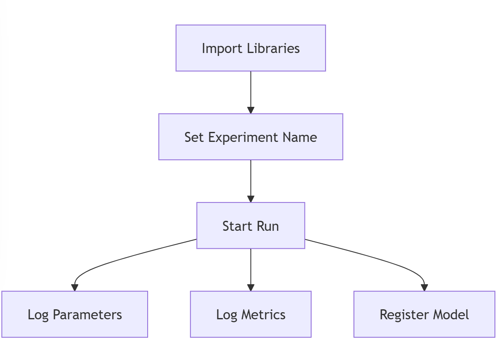
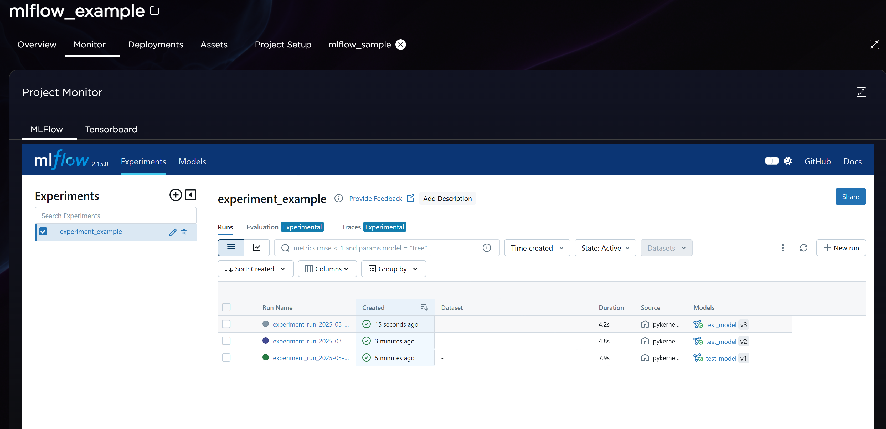

# Model Monitoring with MLFlow Guide

This guide shows you how to track and monitor your machine learning experiments using MLFlow. Think of MLFlow as a diary for your machine learning projects - it helps you record important information about your models, like how well they perform and what settings you used.

## What is MLFlow?
MLFlow is like a notebook that automatically records everything about your machine learning experiments:
- What settings (parameters) you used
- How well your model performed (metrics)
- Saves your trained models
- Keeps track of different versions

## Prerequisites

What you need to get started:
- Python 3.7 or newer
- MLFlow package
- A terminal or command prompt to run commands

## Setup and Installation

1. First, install MLFlow using pip (Python's package installer):
```python
pip install mlflow
```

## Step-by-Step Implementation

### 1. Import the Required Libraries
```python
import mlflow
from mlflow import MlflowClient
from datetime import datetime
```
These lines tell Python we want to use MLFlow and some tools for working with dates and times.

### 2. Create and Run an Experiment

Here's the main code that sets up and runs your experiment:

```python
# Give your experiment a name
mlflow.set_experiment(experiment_name="Experiment")

# Start recording your experiment (like opening a new page in your diary)
with mlflow.start_run(run_name=f"run_{datetime.now().strftime('%Y-%m-%d_%H:%M:%S')}") as run:
    # Print where MLFlow is saving your files
    print(f"Run's Artifact URI: {run.info.artifact_uri}")
    
    # Record your model's settings (parameters)
    mlflow.log_params({
        "top_n": 5,           # Number of results to return
        "show_score": True    # Whether to show similarity scores
    })
    
    # Record how well your model is doing (metrics)
    mlflow.log_metrics({
        "similarity_score": 0.95,  # Example similarity score
        "response_time": 0.85      # Example response time in seconds
    })
    
    # Save your model with a name (like saving a file with a specific name)
    mlflow.register_model(
        model_uri=f"runs:/{run.info.run_id}/model_name", 
        name="Model_Name"
    )
```

### Flow Diagram

Below is a flow diagram that illustrates the process of setting up and running an experiment with MLFlow:




Let's break down what the process:

1. **Creating an Experiment**:
   - `mlflow.set_experiment(experiment_name="Experiment")` creates a new project called "Experiment"
   - Think of this like creating a new folder for your project

2. **Starting a Run**:
   - `mlflow.start_run()` is like opening a new page in your notebook
   - We give each run a unique name using the current date and time (e.g., "run_2024-03-20_13:45:30")
   - This helps us find specific experiments later

3. **Logging Parameters**:
   - `mlflow.log_params()` records the settings you used
   - In this example, we track:
     - `top_n`: How many results to return (set to 5)
     - `show_score`: Whether to show similarity scores (set to True)

4. **Logging Metrics**:
   - `mlflow.log_metrics()` records how well your model performs
   - In this example, we track:
     - `similarity_score`: How similar the results are (0.95 or 95%)
     - `response_time`: How fast the model responds (0.85 seconds)

5. **Registering the Model**:
   - `mlflow.register_model()` saves your model with a specific name ("Model_Name")
   - This makes it easy to find and use your model later
   - You can have multiple versions of the same model

## Viewing An Example

Execute the nb_simple_mlflow.ipynb notebook.

## Monitoring Service

- In the AI Studio project select the “Monitor” tab
- Expand the "Project Monitor" interface to get a better view if needed

Think of this interface like a dashboard where you can:
- [ ] Compare different experiments
- [ ] See how changes in parameters affect your results
- [ ] Keep track of which models perform best
- [ ] Find and use your saved models




## Tips for Beginners
- Always give your experiments clear, meaningful names
- Log all important parameters and metrics
- Use the MLFlow UI to compare different runs

## Additional Resources

- [MLFlow Documentation](https://www.mlflow.org/docs/latest/index.html)
- [MLFlow Tracking](https://www.mlflow.org/docs/latest/tracking.html)
- [MLFlow Model Registry](https://www.mlflow.org/docs/latest/model-registry.html)