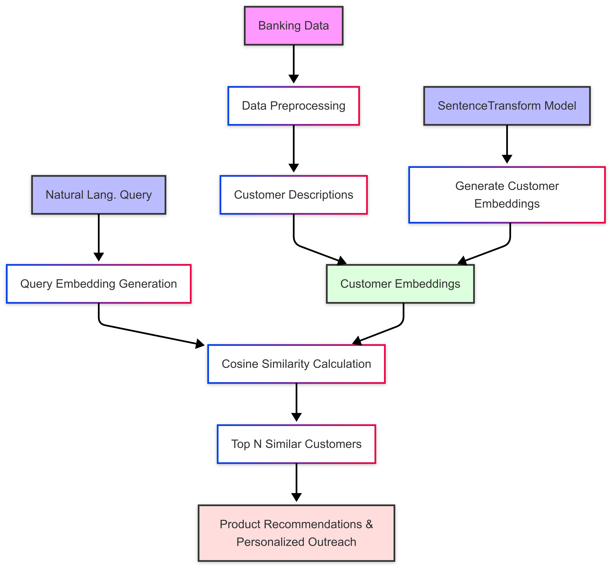
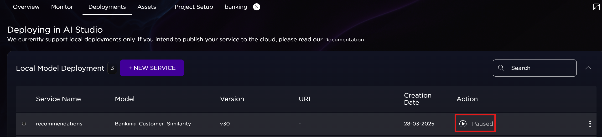
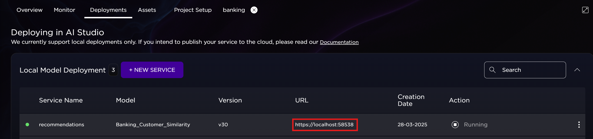
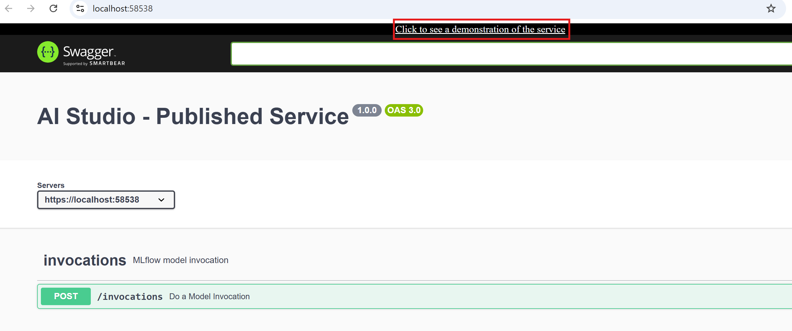
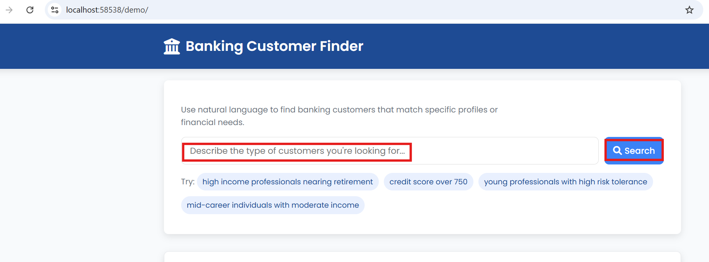

# Banking Customer Similarity System

## Overview
This project implements an AI-powered system for banking relationship managers to identify suitable customers for personalized product recommendations. The system uses natural language processing to match customer profiles with specific queries, moving beyond traditional rule-based targeting to a more nuanced approach.

## Features
- Natural language query interface for finding similar customers
- Semantic search using sentence transformers
- MLflow integration for model versioning and deployment
- Interactive demo interface
- Comprehensive customer profile analysis
- Support for filtering based on credit scores and other metrics

## AI Studio Benefits for Banking Projects

- Custom workspace configuration allows tailoring resources to specific banking model needs
- Connect to multiple data stores across local and cloud networks, essential for accessing sensitive banking data from different secure sources
- Local computation capabilities support processing large financial datasets without network vulnerabilities
- Flexible image options accommodate different banking model requirements, from simple reporting to complex risk analysis
- Team collaboration features enable a range of contributors from data scientists, to UI designers and executives to work as a team
- Monitoring capabilities allow tracking model performance for regulatory compliance
- Service creation functionality enables deployment of models for real-time banking decisions

The platform provides an end-to-end solution for developing, testing, and deploying banking models while maintaining the security, governance, and collaboration features required in the financial sector.

## System Architecture

The system follows this general flow:
1. Customer data processing and embedding generation
2. MLflow model packaging and deployment
3. Query processing and semantic similarity matching
4. Result presentation through the web interface

The diagram below illustrates this architecture and the data flow between components:




## Project Structure

The repository is organized as follows, with dedicated directories for data, model artifacts, demo interface components, and supporting scripts:
```
/
├── data/
│   ├── banking_dataset.csv
│   └── customer_embeddings.npy
├── demo/
│   └── index.html
├── images/
│   ├── banking_flowchart.png
│   ├── deployment1.png
│   ├── deployment2.png
│   ├── deployment3.png
│   ├── deployment4.png
│   ├── deployment5.png
│   └── interface.png
├── model/
│   └── sentence-transformer/
│       ├── 1_Pooling/
│       ├── 2_Normalize/
│       ├── config.json
│       ├── config_sentence_transformers.json
│       ├── model.safetensors
│       ├── modules.json
│       ├── README.md
│       ├── sentence_bert_config.json
│       ├── special_tokens_map.json
│       ├── tokenizer.json
│       ├── tokenizer_config.json
│       └── vocab.txt
├── .venv/
├── 00_generate_data.py
├── 01_embed_data.py
├── 02_nb_deploy_banking_model.ipynb
├── README.md
└── requirements.txt
```

## Requirements
The project requires several Python packages, which are listed in `requirements.txt`. Key dependencies include:

- numpy
- pandas
- torch
- scikit-learn
- transformers
- huggingface_hub
- sentence-transformers
- tf-keras
- mlflow
- tabulate
- pathlib


To install dependencies execute:
```bash
pip install -r requirements.txt
```

## Usage ADD DEPLOY

### 1. Generate Sample Data
Run the data generation script to create synthetic banking customer data:
```bash
python 00_generate_data.py
```

### 2. Create Customer Embeddings
Generate embeddings for the customer profiles:
```bash
python 01_embed_data.py
```

### 3. Deploy Model
Open and run the Jupyter notebook:
```bash
02_nb_deploy_banking_model.ipynb
```

### 4. Create Service

- Select the "Deployments" tab
- Click "Service"


- Fill out the Deployment information  
- Add a "Service Name"  
- Select the model  
- Choose the next highest model version  
- Select "With GPU" configuration  
- Choose your workspace  
- Click "Deploy"  


- The service will appear in the list in a "Paused" state
- Click the run button to start the service



- A URL link will appear once the service is started
- Click on the link



- This will open the Swagger page
- Click the link at the top



- Select a sample search request 
- Enter your own request and click the "Search" button
- View the results




### 5. Query Examples
Once deployed and started, you can query the system with natural language, for example:
- "Find high-income professionals nearing retirement who might be interested in wealth management services"
- "Young professionals with good credit scores who might qualify for premium credit cards"
- "Customers with credit score over 750 interested in investment products"

## Model Details

The system uses the `sentence-transformers/all-MiniLM-L6-v2` model for generating semantic embeddings of customer profiles and queries. This allows for nuanced matching based on meaning rather than exact keyword matches.

## Development

To extend or modify the system:

1. Data Generation `00_generate_data.py`:
   - Modify the customer attributes and product categories
   - Adjust the data generation parameters

2. Embedding Creation `01_embed_data.py`:
   - Change the embedding model
   - Modify the customer description format

3. Model Deployment `02_nb_deploy_banking_model.ipynb`:
   - Adjust the similarity matching logic
   - Modify the result presentation format
   - Add new filtering capabilities

