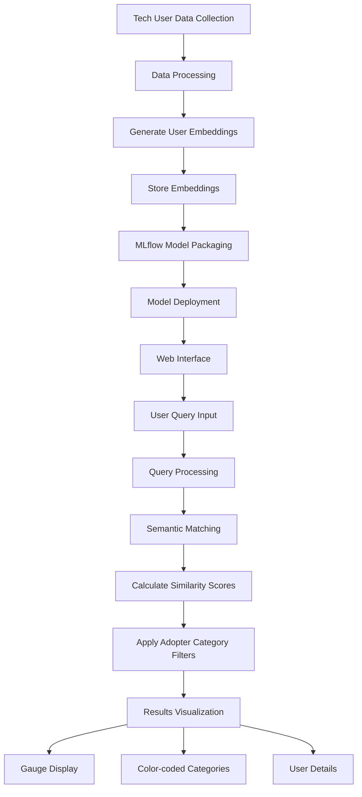

# Tech Adoption Similarity System

## Overview
This project implements an AI-powered system for marketers and IT managers to identify potential customers based on their technology adoption patterns. The system uses natural language processing to match user profiles with specific queries, enabling targeted marketing and product recommendations based on tech adoption behaviors.

## Features
- Natural language query interface for finding similar tech users
- Semantic search using sentence transformers
- MLflow integration for model versioning and deployment
- Interactive demo interface with visual gauge indicators
- Comprehensive tech user profile analysis
- Support for filtering based on adopter categories and tech preferences

## AI Studio Benefits for Tech Adoption Projects

- Custom workspace configuration allows tailoring resources to specific tech adoption model needs
- Connect to multiple data stores across local and cloud networks, essential for accessing user behavior data from different sources
- Local computation capabilities support processing large datasets without network vulnerabilities
- Scalable workspace options (Small/Medium/Large) accommodate different model requirements, from simple user categorization to complex adoption pattern analysis
- Team collaboration features enable product managers, marketers, and data scientists to work together seamlessly
- Monitoring capabilities allow tracking model performance for marketing campaign effectiveness
- Service creation functionality enables deployment of models for real-time tech adoption analysis

The platform provides an end-to-end solution for developing, testing, and deploying tech adoption models while maintaining the flexibility, performance, and collaboration features required in the technology sector.

## System Architecture

The system follows this general flow:
1. Tech user data processing and embedding generation
2. MLflow model packaging and deployment
3. Query processing and semantic similarity matching
4. Result presentation through the web interface with visual gauges



## Project Structure

```
/
├── data/
│   ├── tech_adoption_dataset.csv
│   └── tech_embeddings.npy
├── demo/
│   ├── index.html
│   └── styles.css
├── images/
│   ├── tech_flowchart.png
│   ├── deployment1.png
│   ├── deployment2.png
│   ├── deployment3.png
│   ├── deployment4.png
│   ├── deployment5.png
│   └── interface.png
├── model/
│   └── sentence-transformer/
│       ├── 1_Pooling/
│       ├── 2_Normalize/
│       ├── config.json
│       ├── config_sentence_transformers.json
│       ├── model.safetensors
│       ├── modules.json
│       ├── README.md
│       ├── sentence_bert_config.json
│       ├── special_tokens_map.json
│       ├── tokenizer.json
│       ├── tokenizer_config.json
│       └── vocab.txt
├── .venv/
├── 00_generate_data.py
├── 01_embed_data.py
├── 02_nb_deploy_tech_model.ipynb
├── README.md
└── requirements.txt
```

## Requirements
The project requires several Python packages, which are listed in `requirements.txt`. Key dependencies include:

- numpy
- pandas
- torch
- scikit-learn
- transformers
- huggingface_hub
- sentence-transformers
- tf-keras
- mlflow
- tabulate
- pathlib


To install dependencies execute:
```bash
pip install -r requirements.txt
```

## Usage

### 1. Generate Sample Data
Run the data generation script to create synthetic tech adoption user data:
```bash
python 00_generate_tech_adoption_data.py
```

### 2. Create User Embeddings
Generate embeddings for the tech user profiles:
```bash
python 01_embed_tech_data.py
```

### 3. Deploy Model
Open and run the Jupyter notebook:
```bash
02_nb_deploy_tech_model.ipynb
```

### 4. Create Service

- Select the "Deployments" tab
- Click "Service"


- Fill out the Deployment information  
- Add a "Service Name"  
- Select the model  
- Choose the next highest model version  
- Select "With GPU" configuration  
- Choose your workspace  
- Click "Deploy"  


- The service will appear in the list in a "Paused" state
- Click the run button to start the service


- A URL link will appear once the service is started
- Click on the link


- This will open the Swagger page
- Click the link at the top


- Select a sample search request 
- Enter your own request and click the "Search" button
- View the results with the visual gauges


### 5. Query Examples
Once deployed and started, you can query the system with natural language, for example:
- "Find early adopters with high technical proficiency"
- "Users interested in AI and machine learning with high budget"
- "High budget users from tech sector"
- "Moderate tech interest users in healthcare"

## Model Details

The system uses the `sentence-transformers/all-MiniLM-L6-v2` model for generating semantic embeddings of tech user profiles and queries. This allows for nuanced matching based on meaning rather than exact keyword matches.

## Development

To extend or modify the system:

1. Data Generation `00_generate_tech_adoption_data.py`:
   - Modify the user attributes and tech categories
   - Adjust the data generation parameters

2. Embedding Creation `01_embed_tech_data.py`:
   - Change the embedding model
   - Modify the user description format

3. Model Deployment `02_nb_deploy_tech_model.ipynb`:
   - Adjust the similarity matching logic
   - Modify the result presentation format
   - Add new filtering capabilities based on tech adoption patterns

4. Visual Interface `demo/index.html` and `demo/styles.css`:
   - Customize the gauge visualization
   - Add new visual indicators for adoption categories
   - Enhance the user interface for different device types

