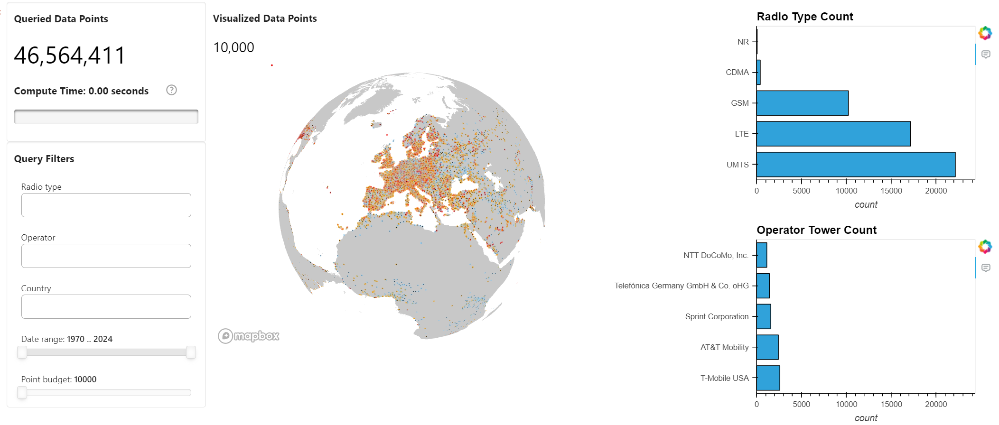

# 📡 OpenCellID Exploratory Data Analysis with Panel and cuDF

## 📚 Contents

- Overview  
- Project Structure  
- Setup  
- Usage  
- Contact & Support

---

## 🧠 Overview

This project is a GPU-accelerated, interactive **exploratory data analysis (EDA)** dashboard for the [OpenCellID](https://www.opencellid.org/) dataset. It uses **Panel** and **cuDF** to deliver lightning-fast geospatial analysis and visualization.

You can explore cell tower distributions by radio type, operator, country, and time window — rendered live on an interactive map with full GPU acceleration.

---

## 🗂 Project Structure

```
├── docs
│   └── ui_opencellid.png 
├── notebooks
│   └── opencellid_eda_with_panel_and_cuDF.ipynb 
├── src
│   └── opencellid_downloader.py               
├── README.md
└── requirements.txt
```

---

## ⚙️ Setup

### Step 0: Minimum Hardware Requirements

Ensure your environment meets the minimum compute requirements for smooth dashboard rendering and cuDF performance:

- **RAM**: 16 GB  
- **VRAM**: 4 GB  
- **GPU**: NVIDIA GPU

### Step 1: Create an AI Studio Project

- Create a new project in [Z by HP AI Studio](https://zdocs.datascience.hp.com/docs/aistudio/overview).

### Step 2: Set Up a Workspace

- Choose **RAPIDS Base** or **RAPIDS Notebooks** as the base image.

### Step 3: Clone the Repository

```bash
https://github.com/HPInc/aistudio-samples.git
```

- Ensure all files are available after workspace creation.

---

## 🚀 Usage

### Step 1: Run the Notebook

Execute the notebook inside the `notebooks` folder:

```bash
notebooks/opencellid_eda_with_panel_and_cuDF.ipynb
```

This will:

- Load the OpenCellID tower data and enrich it with operator metadata  
- Apply GPU-accelerated filters with `cudf.pandas`  
- Launch an interactive dashboard using `panel` and `pydeck` for geospatial rendering  

### Step 2: Use the Dashboard

The notebook launches an embedded interactive dashboard featuring:

- **Filters**: Radio Type, Operator, Country, First Seen (Year), Point Budget  
- **Charts**: Bar plots for radio and operator distributions  
- **Map**: 3D scatterplot of cell tower locations with hover interactivity  
- **Performance Metrics**: Visual indicators for data size and compute time  

### Example Dashboard Snapshot

 

---

## 📞 Contact & Support

- 💬 For issues or questions, please [open a GitHub issue](https://github.com/HPInc/aistudio-samples/issues).
- 📘 Refer to the official [AI Studio Documentation](https://zdocs.datascience.hp.com/docs/aistudio/overview) for detailed instructions and troubleshooting tips.

---

> Built with ❤️ using [**Z by HP AI Studio**](https://zdocs.datascience.hp.com/docs/aistudio/overview).