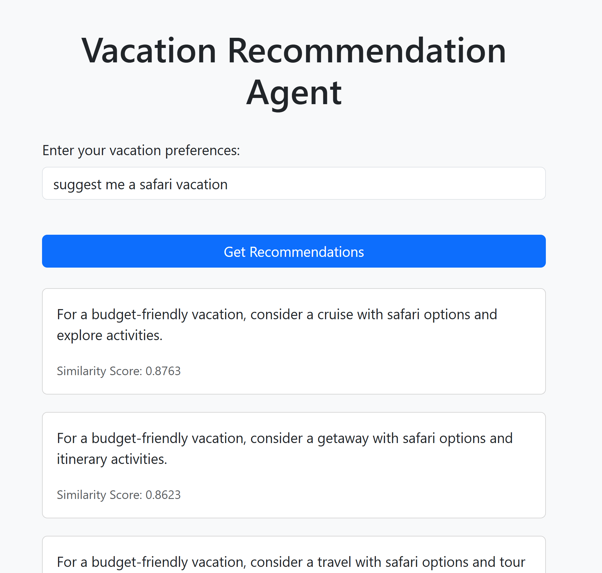

# Tourism Recommendation Agent  

## Content  
- Overview  
- Project Structure  
- Setup  
- Usage  
- Contact and Support  

## Overview  
The **Tourism Recommendation Agent** is an AI-powered system designed to provide personalized travel recommendations based on user queries. It utilizes the **NVIDIA NeMo Framework** and **BERT embeddings** to generate relevant suggestions tailored to user preferences.  

## Project Structure  
```
├── README.md
├── data
│   ├── processed
│   │   └── embeddings.csv (will be created by running the '00_Word_Embeddings_Generation.ipynb' notebook)
│   └── raw
│       └── corpus.csv
├── demo
│   └── index.html
├── docs
│   ├── architecture.md
│   └── ui_tourism.png
├── notebooks
│   ├── 00_Word_Embeddings_Generation.ipynb
│   └── 01_Bert_Model_Registration.ipynb
└── requirements.txt
```  

## Setup  

### Step 1: Create an AI Studio Project  
1. Create a **New Project** in AI Studio.   
2. (Optional) Add a description and relevant tags.  

### Step 2: Create a Workspace  
1. Select **NeMo Framework** as the base image.    

### Step 3: Verify Project Files  
1. Clone the GitHub repository:  
   ```
   git clone https://github.com/HPInc/aistudio-samples.git
   ```  
2. Navigate to `ngc-integration/tourism_recommendations_agent_with_bert` to ensure all files are cloned correctly after workspace creation.  

### Step 4: Verify Project Files  
1. Add the **Bertlargeuncased** model from the NGC model catalog to your workspace. Use the `datafabric` folder inside the workspace to work with this model.

### Step 5: Use a Custom Kernel for Notebooks  
1. In Jupyter notebooks, select the **aistudio kernel** to ensure compatibility.


## Usage  

### Step 1: Generate Embeddings  
Run the following notebook to generate word embeddings and save the tokenizer:  
- `00_Word_Embeddings_Generation.ipynb`.  

### Step 2: Deploy the Service  
1. Execute `01_Bert_Model_Registration.ipynb` to register the BERT model in MLflow and create the API logic.  
2. Navigate to **Deployments > New Service** in AI Studio.  
3. Name the service and select the registered model.  
4. Choose an available model version and configure it with **GPU acceleration**.  
5. Start the deployment.  
6. Once deployed, click on the **Service URL** to access the Swagger API page.  
7. At the top of the Swagger API page, follow the provided link to open the demo UI for interacting with the locally deployed BERT model.  
8. Enter a search query (e.g., *"Suggest a budget-friendly resort vacation."*).  
9. Click **Get Recommendations** to view the results.  

### Successful Demonstration of the User Interface  

  

## Contact and Support  
- If you encounter issues, report them via GitHub by opening a new issue.  
- Refer to the **[AI Studio Documentation](https://zdocs.datascience.hp.com/docs/aistudio/overview)** for detailed guidance and troubleshooting.  

---

> Built with ❤️ using Z by HP AI Studio.